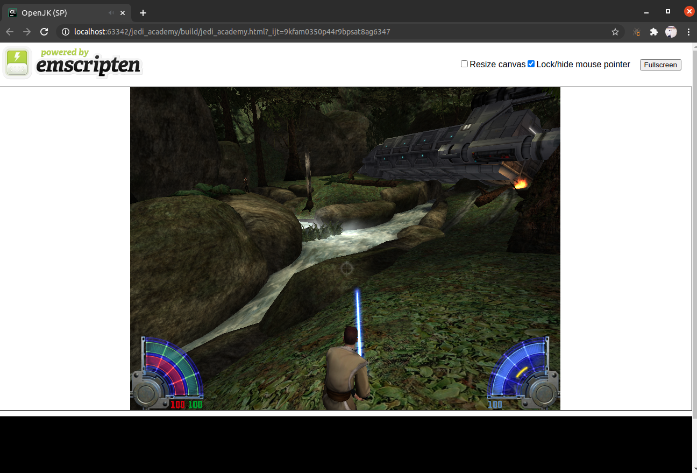

# OpenJK Emscripten Port

## Description

This is an emscripten port of [OpenJK](https://github.com/JACoders/OpenJK) engine used in [Star Wars: Jedi Academy](https://www.youtube.com/watch?v=S8JsJOVaZ58) and
Star Wars: Jedi Outcast games.

The whole game engile is compiled into javascript and WebAssembly and can be ran inside the web browser.

Currently, only JA single player engine is ported. Additional PRs porting multiplayer and Jedi Outcast versions are welcome.

Screenshot:


## Internals

The codebase is based on [OpenJK](https://github.com/JACoders/OpenJK) engine with some tweaks to make it work with
emscripten.

The whole project is built as a single executable, without any static or dynamic linking between engine files. This is
done because emscripten doesn't play well with linking.

Rendering is currently implemented as a GLES emulation of OpenGL using [Regal](https://github.com/p3/regal).


## Performance

The performance is far from perfect. This is mainly because all OpenGL calls are emulated into WebGL. All PRs improving
performance are welcome.

## Building

### Emscripten

Make sure you have version 2.0.11 of emscripten activated. You can check the version by doing `emcc -v`.

```bash
mkdir build
cd build
emccmake ..
emmake make -j8
```

### Native

This project also supports native builds. Note that native builds use OpenGL instead of GLES. Native build steps:

```bash
mkdir build
cd build
cmake ..
make -j8
```

## Running

After the build, there should be jedi_academy.html, jedi_academy.js and jedi_academy.wasm files. Only those 3 files are
required in order for engine to work.

The engine expects the /base game package to be available on localhost:8000.

You can navigate to /base package and run `python3 -m http.server` to start the content server.

You also need to serve the jedi_academy.html file the same way.